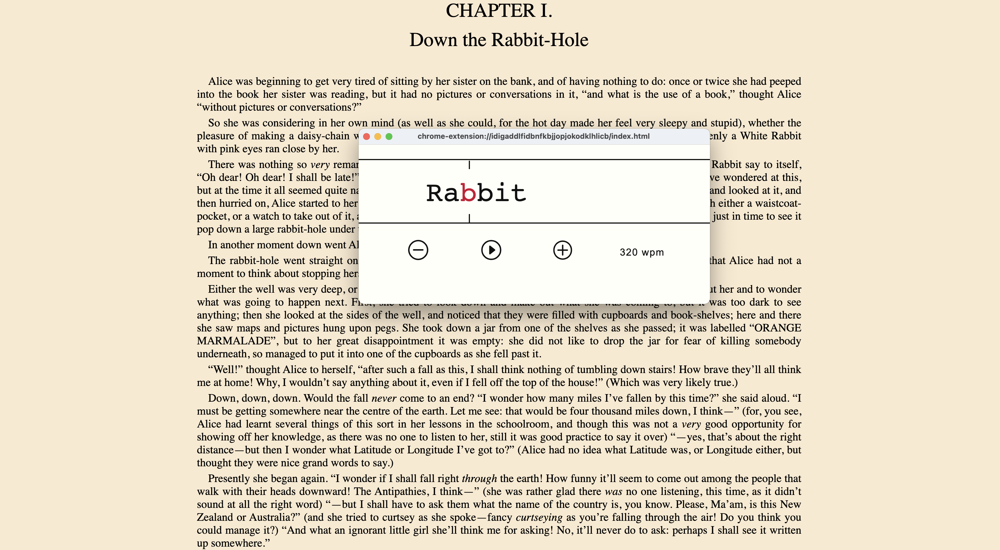

Blip is a single-word speed-reading tool a la Spritz. To use:

1. navigate to a webpage
2. click the blip extensino icon
3. press play

You can adjust the words per minute speed on the fly and also set a default speed in the extension settings.

